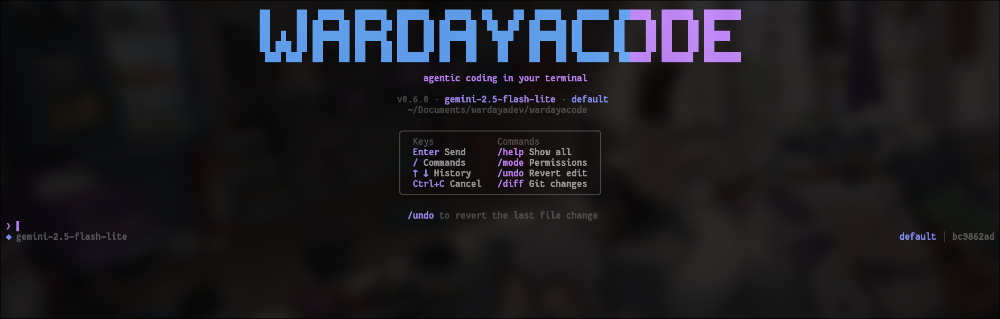

# WardayaCode

**AI-powered coding agent for your terminal.** Multi-provider, permission-aware, and built for real development workflows.

[](package.json)
[](https://www.npmjs.com/package/wardayacode)
[](https://github.com/fawwazmw/wardayacode/actions/workflows/ci.yml)
[](LICENSE)
[](https://github.com/fawwazmw/wardayacode)
[](https://github.com/fawwazmw/wardayacode)

<p align="center">
  
</p>

---

## Install

```bash
npm install -g wardayacode
```

Then navigate to your project and run:

```bash
wardayacode
# or
wdc
```

Requires **Node.js 20+**.

---

## Quick Start

```bash
# Set your API key (choose one)
export ANTHROPIC_API_KEY=sk-ant-...
# or
export OPENAI_API_KEY=sk-...
# or
export GOOGLE_GENERATIVE_AI_API_KEY=AIza...

# Start a session
cd my-project
wardayacode
```

Type any task in natural language. The agent reads your files, makes edits, runs commands, and explains every step.

---

## Features

- **Multi-provider** — Anthropic Claude, OpenAI GPT, Google Gemini. Switch at runtime with `/model`.
- **Permission controls** — Four modes (`default`, `plan`, `acceptEdits`, `auto`) gate every tool call.
- **56+ slash commands** — Full command catalog with tabbed help dialog. Type `/help` to browse.
- **Session management** — Auto-saved conversations, resume across restarts, export to markdown.
- **Undo & checkpoint** — Revert file edits, git stashing, diff viewing.
- **Extensible** — Hook system, skill system, MCP support, custom commands.
- **Privacy-first** — Your code talks through your own API keys. Nothing leaves your machine without your consent.
- **Terminal-native UI** — React + Ink, streaming output, keyboard-driven workflow.

---

## Usage

```bash
# Interactive TUI (default)
wardayacode

# Choose provider and model
wardayacode --model gpt-4o --provider openai
wardayacode --model gemini-2.0-flash --provider google
wardayacode --model claude-sonnet-4-20250514 --provider anthropic

# Permission mode
wardayacode --mode auto          # auto-approve everything
wardayacode --mode plan          # read-only, no writes

# Resume a session
wardayacode --resume <sessionId>

# Max API retries (default: 3, exponential backoff)
wardayacode --max-retries 5
```

---

## Permission Modes

| Mode          | File reads | File writes | Bash / Git | Use case      |
| ------------- | ---------- | ----------- | ---------- | ------------- |
| `default`     | ✅ auto    | ❓ prompt   | ❓ prompt  | Daily use     |
| `plan`        | ✅ auto    | ❌ blocked  | ❌ blocked | Review-only   |
| `acceptEdits` | ✅ auto    | ✅ auto     | ❓ prompt  | Trusted edits |
| `auto`        | ✅ auto    | ✅ auto     | ✅ auto    | Scripting     |

Switch mid-session with `/permissions` or choose "Always allow" when prompted.

---

## Slash Commands

Type `/` in the TUI to open the command palette, or browse the full catalog with `/help`.

| Command       | Description                        |
| ------------- | ---------------------------------- |
| `/status`     | Version, model, mode, session info |
| `/cost`       | Session cost & duration estimate   |
| `/context`    | Context usage visualization        |
| `/theme`      | Switch dark / light mode           |
| `/export`     | Export conversation to markdown    |
| `/rename`     | Name the current session           |
| `/resume`     | Resume a previous session          |
| `/init`       | Create WARDAYA.md for your project |
| `/plan`       | Enter plan mode (read-only)        |
| `/fast`       | Toggle fast mode                   |
| `/stats`      | Usage statistics                   |
| `/model`      | Switch AI model                    |
| `/effort`     | Set effort level (low/medium/high) |
| `/branch`     | Create a git branch                |
| `/diff`       | View uncommitted changes           |
| `/undo`       | Revert last file edit              |
| `/checkpoint` | Create a git stash checkpoint      |
| `/rollback`   | Restore last checkpoint            |
| `/review`     | Pull request review guide          |
| `/copy`       | Copy last response to clipboard    |
| `/insights`   | Session analytics                  |
| `/doctor`     | Installation diagnostics           |
| `/feedback`   | Submit feedback                    |
| `/config`     | Show configuration                 |
| `/clear`      | Reset conversation                 |
| `/compact`    | Manually compact context           |
| `/help`       | Full command catalog               |
| `/exit`       | Exit                               |

Run `/help` inside WardayaCode for the complete list with descriptions.

---

## Tools

The agent uses these tools to interact with your codebase:

| Tool         | What it does                                      |
| ------------ | ------------------------------------------------- |
| `read_file`  | Read a file with optional line range              |
| `write_file` | Create or overwrite a file                        |
| `edit_file`  | Surgical string-replacement edits                 |
| `bash`       | Run shell commands                                |
| `git`        | Run git commands (status, log, diff, add, commit) |
| `glob`       | Find files by pattern                             |
| `grep`       | Search file contents with regex                   |
| `list_files` | List a directory                                  |

Dangerous operations (force push, `rm -rf`, `dd`, etc.) are permanently blocked.

---

## Configuration

Config **priority** (highest wins): CLI flags → project `.wardayacode.json` → user config → defaults.

Create `.wardayacode.json` in your project root:

```json
{
  "provider": "anthropic",
  "model": "claude-sonnet-4-20250514",
  "permissionMode": "default",
  "maxTokens": 8192,
  "temperature": 0,
  "maxRetries": 3,
  "theme": "dark"
}
```

API keys can also live in config, though environment variables are preferred:

```json
{
  "apiKeys": {
    "anthropic": "sk-ant-...",
    "openai": "sk-...",
    "google": "AIza..."
  }
}
```

---

## Sessions

Conversations are auto-saved as JSONL files in `.wardayacode/` in your project directory.

```bash
wardayacode sessions list          # list sessions
wardayacode sessions delete <id>   # delete a session
wardayacode --resume <id>          # resume a session
```

---

## Development

```bash
git clone https://github.com/fawwazmw/wardayacode.git
cd wardayacode
npm install

npm run dev            # run from source (no build)
npm run build          # bundle to dist/
npm run type-check     # TypeScript strict check
npm run lint           # ESLint
npm test               # Vitest watch mode
npm run test:run       # single CI run
npm run test:coverage  # with coverage report
```

### Project Structure

```
src/
├── agent/            — Agent loop (ReAct + Vercel AI SDK)
├── cli.ts            — CLI entry point (Commander.js)
├── config/           — Config cascade (defaults → user → project → CLI)
├── context/          — Context management & auto-compaction
├── extensibility/    — Hook system & skill system
├── permissions/      — Permission gating for all tool calls
├── providers/        — LLM provider adapters
├── session/          — Session persistence (append-only JSONL)
├── tools/            — Tool definitions & execution
├── types.ts          — Core type definitions
├── ui/               — React/Ink terminal UI components
└── utils/            — Logger, retry, self-update, formatting
```

### Branch Strategy

- `main` — Production, matches latest npm release
- `develop` — Integration branch, default for PRs
- `feature/*` — New features
- `fix/*` — Bug fixes
- `release/*` — Release preparation

---

## Keyboard Shortcuts

| Key           | Action                        |
| ------------- | ----------------------------- |
| `!`           | Bash mode                     |
| `/`           | Commands palette              |
| `Tab`         | Auto-complete command         |
| `Esc`         | Clear input / interrupt agent |
| `Ctrl+O`      | Toggle verbose output         |
| `Ctrl+T`      | Toggle task list              |
| `Ctrl+Z`      | Suspend                       |
| `Ctrl+V`      | Paste images                  |
| `Alt+P`       | Switch model                  |
| `Alt+O`       | Toggle fast mode              |
| `Ctrl+S`      | Stash prompt                  |
| `Ctrl+G`      | Edit in `$EDITOR`             |
| `\` + `Enter` | Multi-line input              |

---

## License

MIT — [Fawwaz Mufid W](https://github.com/fawwazmw)
